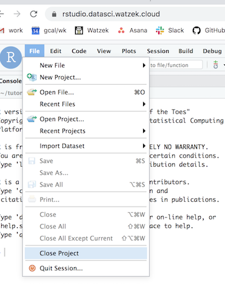

# rinat-biodiversity

Numbers: iNaturalist data & biodiversity

Link to this page: http://bit.ly/binford-inat

### Info for logging in to Rstudio Server

* Visit <a href='https://datasci.watzek.cloud' target='_blank'>https://datasci.watzek.cloud</a>
* Sign in with your Lewis & Clark username and password. If you haven't created an account yet, you'll be prompted to create a password.
* Once signed in, click "RStudio Server", after which you will need to sign in again (LC username / password you just created)

### Loading the workshop content:

Before doing anything, make sure you close any current projects in RStudio:

in console (lower left-hand corner):
* library(usethis)
* use_course("https://github.com/jeremymcwilliams/rinat-biodiversity/archive/0.1.zip")

After running the command above, you'll be prompted whether to download to your current directory. Go ahead and answer in the affirmative (you'll be presented with variations on "yes"). Once the course files download, you'll be prompted as to whether to delete the zip file. Again, answer in the affirmative. Once you do, click "Save", and your window will refresh to a new R session.  

To get started, click "bio110-chemotaxis-two-strains.Rmd" in the files window, and then minimize the console window. 